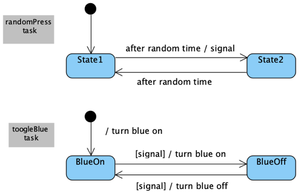

# Lab 2 Starter Code

Clone this project with the starter code for lab 2. First read it and then run it, before making any changes.

The code flashes one of the on-board blue LED on the KL25Z development board at random intervals. There are two tasks:
  1. The 'randomPress' tasks simulates a button press at random intervals.
  1. The 'toogleBlue' task toggles the blue LED on each button press.

The behaviour is described by the following state-transition diagram: 

